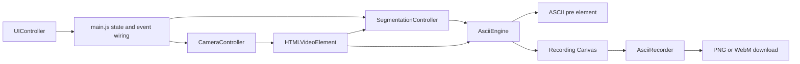

# Architecture

## Scope

Glyphr Monocam is a static client-side web application. It has no server, database, application API, authentication system, or persistent storage layer. The browser is responsible for camera access, segmentation execution, ASCII conversion, display, and media export.

## High-Level Design



## Components

### `index.html`

Defines the visible interface: status bar, viewfinder, palette selector, background toggle, mode controls, shutter, microphone toggle, resolution slider, theme control, and camera-switch control. It loads MediaPipe from jsDelivr and starts the ES module entry point.

### `src/main.js`

Owns application orchestration. It creates the module instances, maintains small shared state, routes UI events, applies themes and palettes, updates the clock and battery display, starts the render loop, starts or stops recordings, and registers cleanup on page exit.

### `src/camera.js`

Requests the camera with an ideal 1280x720 resolution and ideal 60 FPS. It owns stream replacement and stops old tracks before a facing-mode switch to prevent camera-resource leaks. The front-facing camera is identified as `user`; only that mode is mirrored by the renderer.

### `src/segmentation.js`

Wraps the global MediaPipe `SelfieSegmentation` API. It configures `modelSelection: 1`, resolves model assets from jsDelivr, receives results through `onResults`, and exposes a `busy` flag so the render loop does not enqueue overlapping inference requests.

### `src/asciiEngine.js`

Implements the visual pipeline:

1. Smoothly interpolates from the current sampling scale to the slider target.
2. Downsamples the video frame onto a read-optimized Canvas.
3. Draws the segmentation mask onto a matching Canvas when background removal is enabled.
4. Calculates luminance for each sampled pixel with `0.2126r + 0.7152g + 0.0722b`.
5. Inverts brightness in light theme mode.
6. Maps brightness to the active palette and emits the ASCII frame into the `<pre>` element.
7. Paints the latest ASCII lines onto a Canvas for photo and video output.

The engine measures a character probe only when metrics are marked dirty, rather than on every frame. It recalculates the display font size from the viewfinder bounds and character-cell ratio.

### `src/recorder.js`

Turns the ASCII recording Canvas into a 30 FPS `MediaStream` through `captureStream(30)`. If microphone capture is enabled and granted, it creates a combined stream from the video and audio tracks. It selects a supported WebM MIME type, gathers chunks, emits a Blob on stop, and stops owned media tracks during cleanup.

### `src/ui.js`

Queries DOM elements once, translates control interactions into custom events, manages the active mode, handles visual status state, displays battery and time information, and triggers the shutter flash.

### `src/palettes.js` And `src/themes.js`

Keep palettes and theme state declarative. Palette selection is immediate; custom palette input is preserved without trimming meaningful leading spaces. Themes control the body class, output colors, and whether brightness mapping should be inverted.

## Runtime Data Flow

```text
Camera stream
  -> video element
  -> requestAnimationFrame loop
  -> MediaPipe segmentation result
  -> sampled video pixels plus optional mask pixels
  -> luminance-to-character mapping
  -> ASCII text in pre element
  -> optional recording canvas frame
  -> MediaRecorder Blob download
```

## Event Flow

The UI controller dispatches custom events for palette, resolution, background, theme, camera mode, capture mode, and shutter interactions. `main.js` subscribes to those events and calls the appropriate module method. The recorder also emits start, stop, recorded, microphone-denied, and error events so UI state is updated from recording lifecycle events rather than from DOM side effects.

## Design Decisions

- ES modules provide separation of concerns without a framework or bundler.
- Canvas uses `willReadFrequently: true` where pixel data is read on the hot path.
- The segmentation wrapper prevents concurrent sends through a `busy` guard. This favors keeping the preview current over queueing stale frames.
- Recording renders the text representation into a Canvas so exported media reflects the ASCII output instead of raw camera video.
- The application does not send application data to a custom backend. External network requests are still required for the configured MediaPipe CDN and Google Fonts.

## Scalability And Performance

There is no server-side scaling dimension because the app is static. Client performance is the relevant concern. Work scales with sampled character-grid size, not directly with the full camera resolution after downsampling. The resolution slider exposes that trade-off, and the segmentation `busy` guard avoids unbounded inference backlog.

## Constraints

- Camera and microphone access require user permission and a secure browser context.
- Battery Status API support is browser-dependent.
- MediaRecorder support and available WebM codecs are browser-dependent.
- No fallback model source, local model bundle, or offline mode is implemented.
